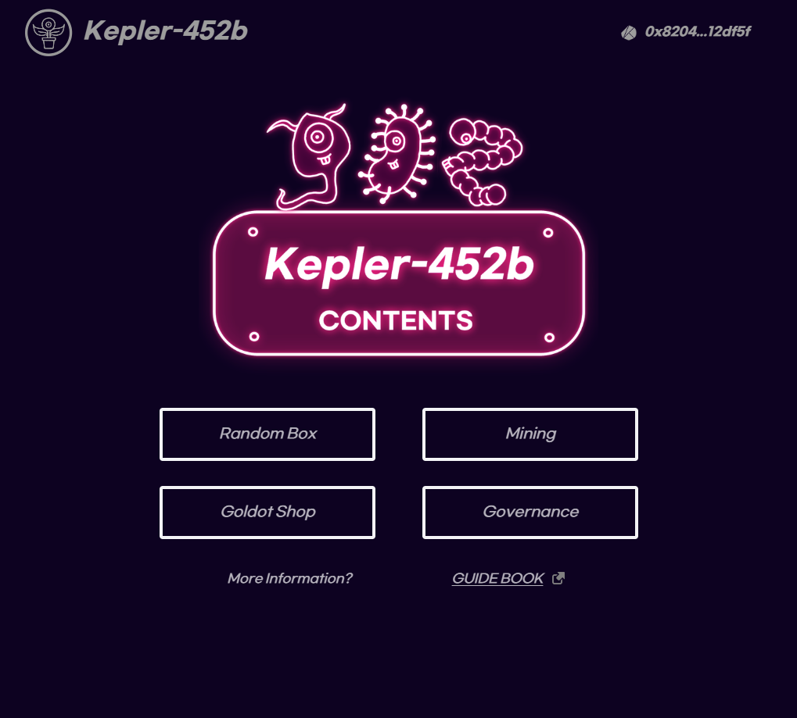

# Kepler-452b

    NextJS + TypeScript + TailwindCSS

## 포트폴리오 전용

- Klaytn 체인에서 진행한 NFT 프로젝트입니다.
- 날씨에 따라 이미지가 생장하는 우주 식물을 컨텐츠로 진행하였습니다.
- openCV 라이브러리를 활용하여 Generative Art 생성 로직 개발하였습니다.
- BlockChain Transaction API를 통해 NFT metadata 업데이트하였습니다.

본 페이지는 지갑이 없음을 고려하여 특정 기능을 더미화 시킨 페이지입니다.

---

## 미리보기

- ERC-1155 자산을 활용하여 ERC-721 자산의 property를 변경하거나 또 다른 가치의 ERC-1155 자산으로 변경할 수 있습니다.
- ERC-721 자산이 끊임 없이 늘어나는 구조인 만큼 소각 모델을 고려하여 ERC-1155을 통한 가챠 모델을 구성하였습니다.
- 사용자는 애니메이션을 통한 상호작용을 통해 전체 자산 중 3,000개 이상의 ERC-721 자산을 소각하였습니다.
- DAO 모델을 만들기 위해 보유 수량만큼 투표할 수 있도록 하였습니다.
  - 사용자는 signMessage를 통해 서명할 수 있었으며, 서명하는 유저의 보유량만큼 투표가 가능하도록 했습니다.

---

### Link

- [Main](https://kepler.wontae.net)
- [Docs](https://docs.kepler.wontae.net/)
- [Medium](https://medium.com/@Kepler-452b)
- [OpenSea](https://opensea.io/collection/kepler-452b-official)
